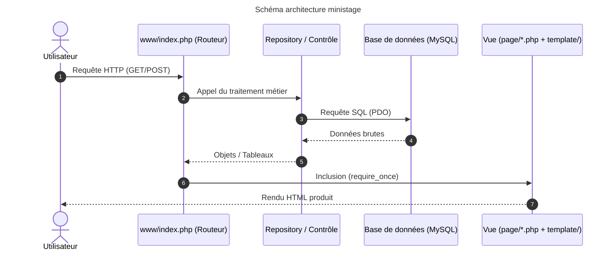

| Fonctionnalité | Avant refactorisation | Après refactorisation | Résultat |
|----------------|-----------------------|-----------------------|----------|
| Connexion | OK | OK | OK |
| Accueil | OK | OK | OK |
| Consultation | OK | OK | OK |
| Réservation | OK | OK | OK |
| Paramètres | OK | OK | OK |

## 1. Analyse de l’existant
    Les liens entre les salles ne marchaient pas 

## 2. Architecture WebArt

    www/ : c'est là où il y a le routage et généralement le fichier index
    controle/ : c'est là où il y a les différentes fonctions pour faire fonctionner l'application(1 script dans controle = 1 fonction)
    page/ : c'est le contenu de chaque page
    template/ : là où il y a le header et le footer
    data/ : contient les script SQL
    config/ : fichier de configuration de la base de donnée

## 3. Refactorisation réalisée
    src,sql et public ne sont plus et sont remplacés par page,data,config et www

## 4. Parcours d’une requête
### Consultation des salles :
URL (.../index.php?route=salles)

➔ index.php (lit route=salles)

➔ Contrôleur (SalleRepository::findAll())

➔ Données (SELECT * FROM salle)

➔ Page (page/sallesPage.php)

➔ Template (header.php et footer.php)

➔ Réponse HTML (Page affichée dans le navigateur)

## 5. Difficultés rencontrées
    Précipitation dans la factorisation (vouloir tout factoriser d'un coup) donc beaucoup d'erreurs et compliqué de s'y retrouver

## 6. Tests
    J'ai essayé le site et toute les fonctions comme la création d'un créneau de réservation ou encore l'annulation d'une réservation

## 7. Bilan personnel

* **Un point d'entrée (index.php)** : tout passe au même endroit. On évite les fichiers PHP éparpillés qu'on pouvait appeler directement depuis l'URL.
* **Sécurité** : les requêtes préparées PDO bloquent les injections SQL. En plus, la suppression est ciblée et ne risque plus d'effacer d'autres lignes.
* **Séparation propre (MVC / WebArt)** : le SQL et la logique métier restent dans controle/, le HTML va dans page/ et template/. Tu peux retoucher le design sans toucher au code SQL.
* **Moins de bugs** : la vérification des créneaux empêche de réserver deux fois la même salle en même temps, et le typage strict remonte les erreurs beaucoup plus vite.

