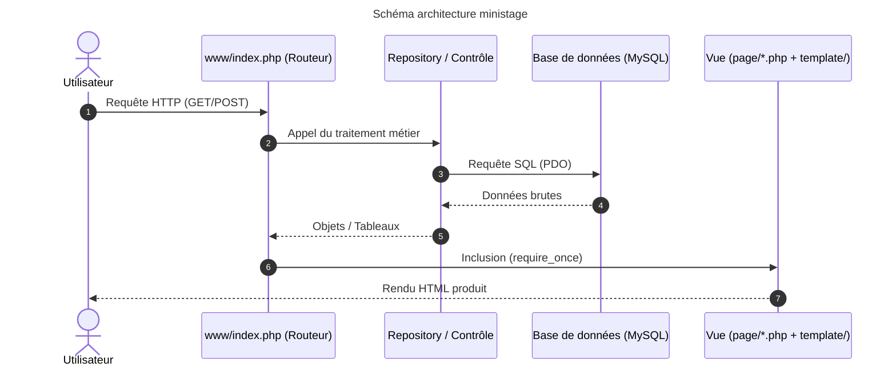

```mermaid
---
title: Schéma architecture ministage
---

sequenceDiagram
autonumber
actor U as Utilisateur
participant R as www/index.php (Routeur)
participant C as Repository / Contrôle
participant B as Base de données (MySQL)
participant V as Vue (page/*.php + template/)

    U->>R: Requête HTTP (GET/POST)
    R->>C: Appel du traitement métier
    C->>B: Requête SQL (PDO)
    B-->>C: Données brutes
    C-->>R: Objets / Tableaux
    R->>V: Inclusion (require_once)
    V-->>U: Rendu HTML produit

```